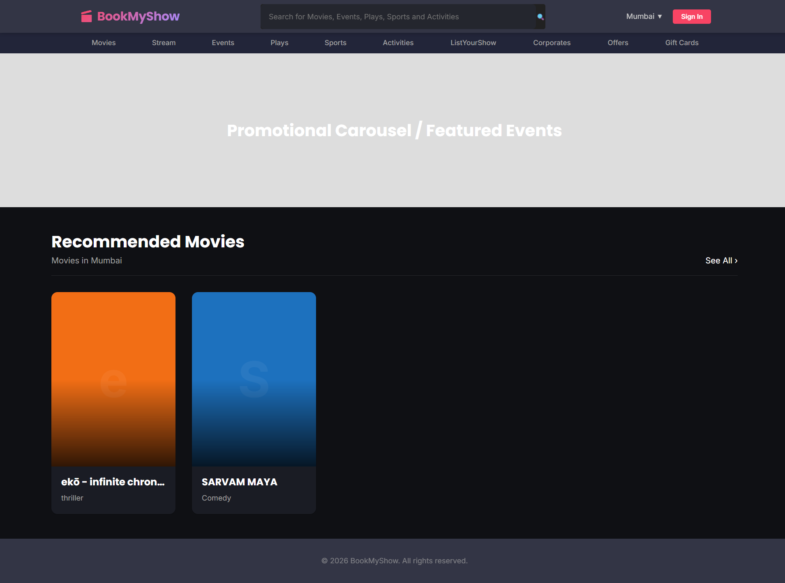
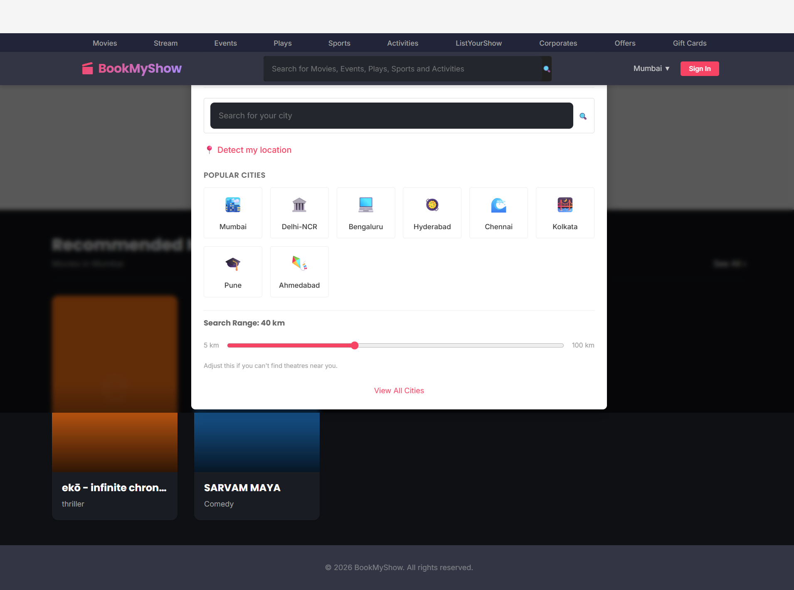
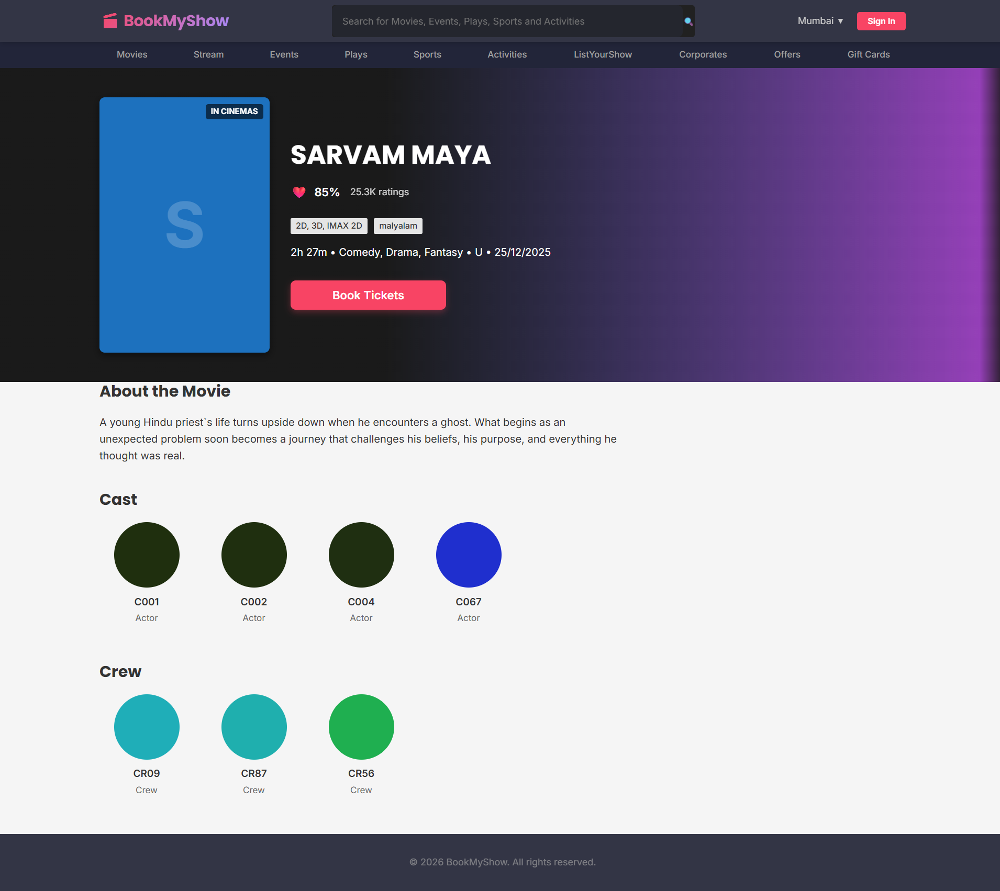
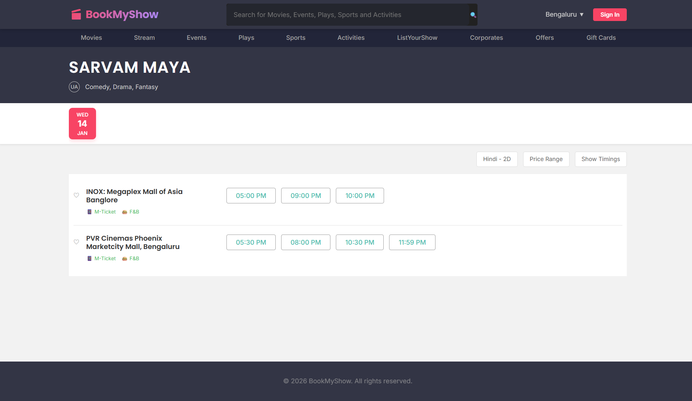
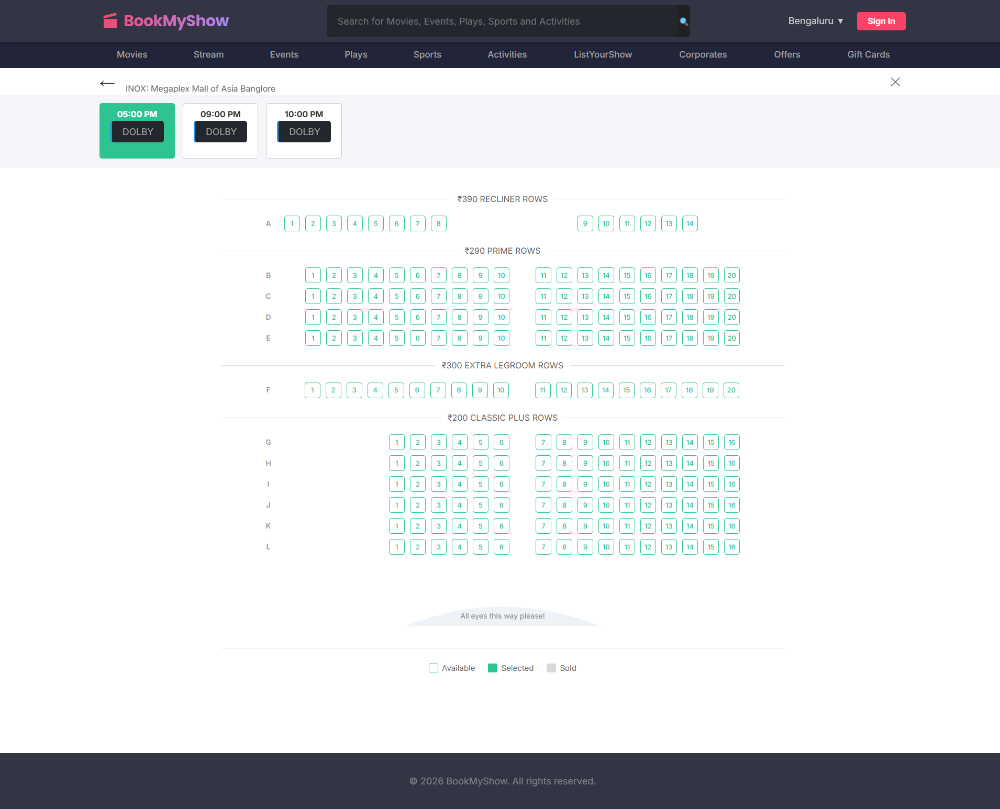
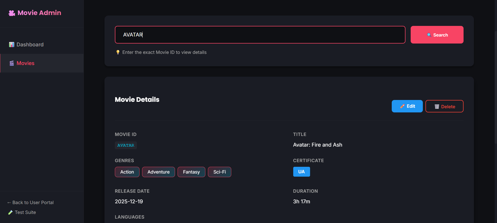
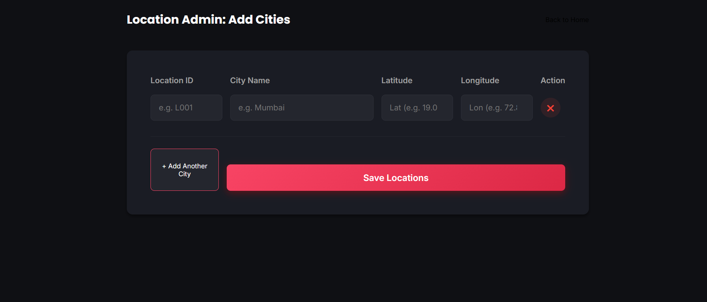

# BookMyShow: End-to-End Cinema Management & Booking System

A high-performance movie ticket booking platform engineered with a microservices-based architecture. This system manages the complete lifecycle of movie discovery, theatre operations, real-time seat orchestration, and secure payment processing.

## Backend Architecture

The system is powered by a robust backend infrastructure designed for high concurrency and low latency:

- **Golang Microservices**: Core business logic is distributed across specialized services (Movie, Theatre, Booking, Payment) written in Go for maximum performance.
- **gRPC Communication**: Internal service-to-service communication is handled via gRPC, ensuring type-safe, low-latency data exchange.
- **GraphQL Gateway**: A centralized API entry point that orchestrates requests to various internal microservices, providing a flexible data fetching layer for the frontend.
- **Kafka Event Streaming**: Utilized for asynchronous event processing and decoupling service dependencies, ensuring system resilience.
- **Redis Orchestration**: Real-time seat locking, dynamic availability mapping, and session management are handled via atomic Redis operations.
- **PostgreSQL Persistence**: Primary relational database for complex data structures including theatre configurations, screen layouts, and booking records.

## Visual Overview

### User Experience

The user portal prioritizes ease of use with proximity-based movie discovery and a seamless booking flow.

*Proximity-based movie discovery*

*Regional content filtering*

*movie details*

*Real-time show availability of theatres* 

*Real-time seat mapping and selection*

### Administrative Control

The admin portals provide granular control over the cinema ecosystem, with a heavy emphasis on dynamic screen layout creation.

#### Screen Layout System
The system features a custom-built visual editor for generating complex screen layouts. This allows admins to define seat categories, handle irregular seating arrangements, and automatically generate seat identifiers that are synced across the Booking and Display services.

*Screen layout and theatre management*

*Full movie lifecycle and metadata control*

*Proximity and regional configuration*

## Technical Flow

The system follows a strict operational path:
1. **Discovery**: GraphQL fetches movies and filtered shows using location proximity.
2. **Locking**: Upon seat selection, the Booking Service creates an atomic lock in Redis.
3. **Transaction**: The Payment Service processes webhooks; successful transactions trigger a gRPC call to confirm the booking in PostgreSQL.
4. **Dispatch**: Confirmed bookings are emitted via Kafka for asynchronous notification and finalization.

---
*This repository contains the professional frontend interface and coordination logic for the overall BookMyShow architecture.*
