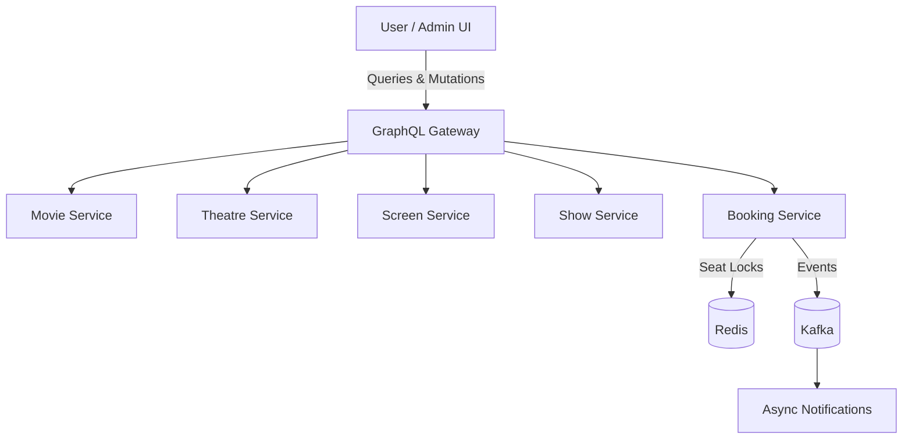
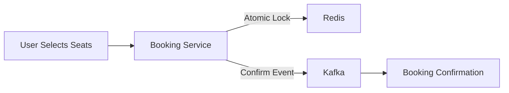

# Movie & Event Booking Platform – Frontend

A production-grade frontend application for a high-concurrency movie and event booking system, inspired by BookMyShow-scale architectures. This repository focuses on the **user and admin-facing interfaces** and acts as the primary entry point into a distributed backend composed of multiple Go microservices.

This frontend communicates exclusively through a **GraphQL API Gateway**, which orchestrates requests across backend services using gRPC and event-driven workflows.

---

## System Overview

The platform supports the complete booking lifecycle:

* Movie discovery based on user location
* Theatre, screen, and show management via admin workflows
* Real-time seat availability and concurrent booking protection
* Asynchronous booking finalization through backend events

The frontend is intentionally kept independent and stateless, designed to scale horizontally behind a CDN.

---

## Architecture Highlights

* **GraphQL API Gateway**
  Single entry point for all client interactions, aggregating data from multiple backend services and minimizing over-fetching.

* **High-Concurrency Booking Flow**
  Seat selection reflects real-time availability backed by Redis-based atomic seat locking in the Booking Service.

* **Event-Driven Backend Coordination**
  Booking confirmations and downstream actions are processed asynchronously via Kafka, keeping the UI responsive under load.

* **Role-Based Interfaces**

  * User portal for discovery, seat selection, and booking
  * Admin portals for movie, theatre, screen layout, and show management

---

## Backend Services (External)

This frontend integrates with the following backend services hosted under a dedicated GitHub organization:

* Movie Service
* Theatre Service
* Screen Service
* Show Service
* Booking Service
* Payment Service

Backend repositories: [https://github.com/movie-event-booking](https://github.com/movie-event-booking)

---

## High-Level Request Flow

---

## Booking Flow (Simplified)

---

## Visual Overview

### User Experience

The user portal prioritizes ease of use with proximity-based movie discovery and a seamless booking flow.

*Proximity-based movie discovery*

*Regional content filtering*

*Movie details and metadata*

*Real-time show availability across theatres*

*Live seat mapping with concurrent locking feedback*

### Administrative Control

The admin interfaces provide granular control over the cinema ecosystem with a focus on operational correctness and flexibility.

#### Screen Layout System

Admins can visually design complex screen layouts, define seat categories, and handle irregular seating arrangements. Generated seat identifiers are synced with backend Booking and Display services.

*Screen layout and theatre management*

*Movie lifecycle and metadata control*

*Proximity and regional configuration*

---

## Design Principles

* Clear separation between frontend and backend ownership
* No direct service-to-service coupling from the client
* Optimized for high read traffic and bursty booking events
* Built to resemble real-world, production deployment patterns

---

*This repository contains the frontend application only. Backend logic, data stores, and event pipelines are maintained independently in the backend organization.*
